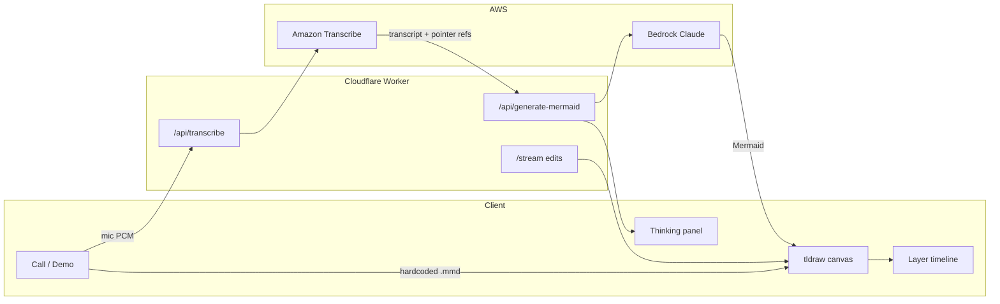

# Possessed Pen

**An agent that only draws.** Start a call, talk over the board, hover what you mean. Ink appears. No chat transcript.

Cursor Austin × [AITX Hackathon](https://luma.com/cursor-austin-grok-001) · 19 Sep 2026  
Repo: [xinning-inorsa/possessed-pen](https://github.com/xinning-inorsa/possessed-pen)

Built on the [tldraw Agent starter kit](https://tldraw.dev/starter-kits/agent). The model emits **Mermaid topology**; [`@tldraw/mermaid`](https://www.npmjs.com/package/@tldraw/mermaid) lays it out as native tldraw shapes. Never LLM `(x, y)` for a full diagram.

## Short write-up

Whiteboards and diagram tools still force a split: you think out loud with your hands, then you stop and type. Chat-first canvas agents make it worse — they dump a transcript beside the board and ask a model for raw coordinates, so drawings look accidental. Possessed Pen is for people who already think on a board: product managers walking an auth flow, architects explaining a service map, founders pitching a system. They need the canvas to keep up with speech and pointing, not another prompt box.

You start a call, talk over an infinite tldraw canvas, and hover or lasso the shapes you mean. Amazon Transcribe turns speech into text; the client binds deixis like “this” and “that box” to shapes from the pointer trail; Claude on Amazon Bedrock returns topology as Mermaid. Layout is deterministic via `@tldraw/mermaid`. The agent never paints freehand coordinates. If Bedrock is down, Demo still works: a hardcoded auth-flow seed with zero typing.

The impact is a working system, not a slide. A real user can go from empty board to a structured diagram in one spoken pass, then surgically edit a cluster without regenerating the rest. There is no chat UI. Output is ink and layers. Built in a day on the tldraw agent kit for the Cursor Austin × AITX hackathon.

## Team

| Name | Role | Contact |
|------|------|---------|
| Xinning Wang | Solo builder | [xinning@inorsa.com](mailto:xinning@inorsa.com) · [github.com/xinning-inorsa](https://github.com/xinning-inorsa) |

## Quick start

**Node 22+** and **Bun 1.3+** required.

```bash
nvm use                    # .nvmrc pins 22
bun install
cp .dev.vars.example .dev.vars
bun run dev
```

Open http://127.0.0.1:5173/

**Cursor / VS Code:** Run and Debug → **Dev — install + start**. That runs `bun install`, then Vite + the Cloudflare worker, and opens the app when the server is ready.

**Demo works with no API keys.** Press **D** or click **Demo** for a hardcoded auth-flow diagram. Voice generate/edit needs credentials in `.dev.vars` (see [Reproduce the demo](#reproduce-the-demo)).

Full workstation notes: [SETUP.md](./SETUP.md).

## Tech stack

| Layer | Choice |
|-------|--------|
| Canvas | [tldraw](https://tldraw.dev) v5, full-screen infinite canvas |
| Layout | `@tldraw/mermaid` — Mermaid → native shapes |
| UI | React 19 — call button, Demo, layer timeline, thinking panel. **No chat panel.** |
| Worker | Cloudflare Worker (Vite plugin) + Durable Object |
| LLM | Amazon Bedrock, Claude Sonnet 4.5 via `@ai-sdk/amazon-bedrock` |
| Speech | Amazon Transcribe streaming WebSocket (browser PCM, Worker-presigned) |
| Package manager | Bun (`bun.lock`) |

### Architecture



| Path | Role |
|------|------|
| `client/` | React UI, voice session, deixis, Mermaid apply |
| `worker/` | Bedrock, Transcribe presign, Durable Object |
| `shared/` | Types, schemas, model ids |
| `client/seed/authFlow.mmd` | Offline Demo seed |

Empty canvas / generate: `/api/generate-mermaid` → `createMermaidDiagram`.  
Edits: surgical actions (`label`, `delete`, `create`, `place`, `update`) by default; `replace_in_bounds` only when the user asks to restructure a cluster.

## Reproduce the demo

### 1. Offline Demo (no keys)

1. `bun run dev` → http://127.0.0.1:5173/
2. Click **Demo** or press **D**.
3. An auth flowchart appears; a layer shows in the left strip.
4. This path never calls Bedrock.

### 2. Voice generate / edit (keys required)

Copy [`.dev.vars.example`](./.dev.vars.example) → `.dev.vars` (gitignored):

| Variable | Required for | Notes |
|----------|----------------|-------|
| `AWS_BEARER_TOKEN_BEDROCK` | Generate / redo | Preferred on Cloudflare Workers |
| `AWS_REGION` | Bedrock + Transcribe | e.g. `us-east-1` |
| `BEDROCK_MODEL_ID` | Optional | Default: Claude Sonnet 4.5 on Bedrock |
| `AWS_ACCESS_KEY_ID` | Voice STT | IAM — bearer token does **not** work for Transcribe |
| `AWS_SECRET_ACCESS_KEY` | Voice STT | Needs `transcribe:StartStreamTranscriptionWebSocket` |
| `AWS_SESSION_TOKEN` | Voice STT if using STS | Optional |

Then:

1. Click the call button (mic permission).
2. Talk over the empty canvas, e.g. “draw a login flow with gateway, auth, and app.”
3. Hover or lasso a node and say “make this a decision with yes and no paths.”
4. Neighbors stay put; scrub layers to compare generations.
5. Open the thinking panel to see transcribe → prompt → Mermaid.

**Esc** ends a call or cancels inking.

There is **no deployed URL**. Judges should run locally; Demo is the zero-config path.

## Data and provenance

No external datasets. The only bundled “data” is synthetic Mermaid written for this hackathon:

- [`client/seed/authFlow.mmd`](./client/seed/authFlow.mmd) — User → API Gateway → Auth Service → Application / Error. Authored in-repo so Demo works if Bedrock is down.
- Voice transcripts are created live in the browser and sent to Amazon Transcribe; they are not stored as a training set.
- Generated diagrams are model output, not a third-party corpus.

## Known limitations and next steps

**Limitations**

- Hackathon scope: no chat UI, no freehand art, no multiplayer, no production deploy.
- Generate/edit requires Bedrock; voice requires IAM Transcribe credentials. Demo does not.
- Deixis is compressed after you stop speaking (refs + hover/dwell/circle). The model does not watch a live pointer stream or canvas screenshot.
- Selection redo is capped; layer-level history is the reliable undo story.
- tldraw SDK watermark on canvas for dev/hobby use ([license](https://tldraw.dev/community/license)).

**Next steps**

- Hosted Worker deploy with secrets so judges do not need local AWS.
- Tighter surgical edits on large diagrams; less `replace_in_bounds`.
- Optional export (SVG / Mermaid source) for decks.

## Scripts

| Command | Description |
|---------|-------------|
| `bun run dev` | Vite + worker (`vite --host`) |
| `bun run build` | Production bundle |
| `bun run typecheck` | `tsc --noEmit` |
| `bun run preview` | Preview production build |

On Linux/WSL, Vite 8 needs the rolldown native binding (see `optionalDependencies`). Launch uses `scripts/vite-dev.sh` if file-watch limits are tight.

## Cursor / agent setup

- [`AGENTS.md`](./AGENTS.md) — agent front door
- [`.cursor/rules/`](./.cursor/rules/) — stack, product boundaries
- [`.vscode/launch.json`](./.vscode/launch.json) — one-click **Dev — install + start**
